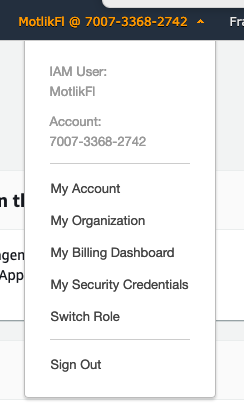
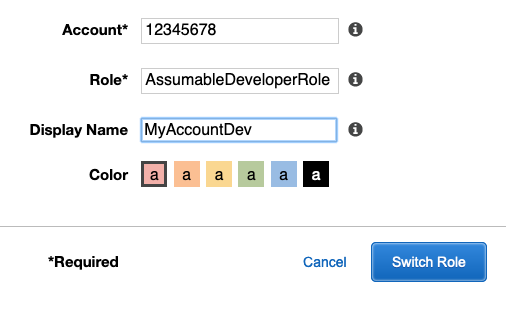

# Cross Account Access

Best practice in AWS organizations is using roles in sub accounts that developers can assume for any action they want to perform in the sub-account. This documentation will introduce how cross account role access works, how to perform it with the aws cli and how to use tools that make this process easier. 

## Cross Account Role Setup in the AWS Baseline

This AWS Baseline rolls out various Roles to assume, including Admin, Developer, ReadOnly or Operations. Once a user decides to assume a specific role in a sub-account they have to get short-lived (up to 12 hours) credentials for that role. Those credentials can then be exported into the current environment of their terminal and used by the language specific aws-sdks.

By default assuming a role in a sub-account is protected by Multi Factor Authentication, so make sure your account has MFA activated.

Before going into details on using the cli with roles in sub-accounts let's take a look at switching roles in the AWS Console.

### Switching Roles in the AWS Console

To assume a role in the AWS Console, and therefore be able to view or edit resources in another account, all you need is the AccountId of the account you want to switch to and the name of the Role you want to assume.

After logging into your AWS Account you can select the Organizations service on the top left, which will give you the option to list all accounts in the current organization (if your user is permitted to do so). With this information and the name of the role you want to assume (please ask your `AWS Account Administrator` for details on the name) you can now open the menu with your Username on the rop right and click `Switch Role`:



Select Switch role on the next page and you should be presented with a form with fields for `Account`, `Role`, and `DisplayName`. Fill this out accordingly and click the `Switch Role` button. 



If you account has proper access rights you should now be able logged into the new account. If you open the top right menu you should see the AccountId you just entered and also the link to go back to your main account. The configuration you entered before will be stored in your browser, so if you want to switch again (or if you have multiple configurations, e.g. for dev and prod accounts) you can switch quickly.

For more Information you can also check out the [AWS Switch Role Documentation](https://docs.aws.amazon.com/IAM/latest/UserGuide/id_roles_use_switch-role-console.html)

## Switching Roles in the AWS CLI

In the AWS CLI you have two options to switch roles, through profiles or by aquiring credentials directly and exporting them to your environment. Typically you will use both options regularly during the day, so you should familiarize yourself with both of them. The upside of profiles is that they are quick to use and the AWS cli takes care of the credentials. The downside is that they typically only last for an hour, so if you use MFA you have to enter it regularly. Also not all tools implement caching of credentials when using profiles, so you might have to enter your MFA details anytime you run the tool.

For those cases getting credentials directly and exporting them is a better option, as it also allows you to set longer durations. 

We'll start with an explanation of how to use credentials directly and will then follow with a profile example.

### Getting credentials with the cli

After getting your own keys and [configuring the aws cli](https://docs.aws.amazon.com/cli/latest/userguide/cli-chap-configure.html) you can run the following command to verify who your current credentials belong to:

```bash
aws sts get-caller-identity
{
    "UserId": "AIDA41PGWXOK5F4BT4BP",
    "Account": "814916968542",
    "Arn": "arn:aws:iam::814916968542:user/fmotlik"
}
```

Once we've established we're logged in as the right user we can start using `STS`, the AWS Security Token Service.

We're going to use the [`aws sts assume-role`](https://docs.aws.amazon.com/cli/latest/reference/sts/assume-role.html) command to assume into a specific account. As we've enabled MFA on our account we need to set the `serial-number` and `token-code` parameter.

Once you run it your output should look similar to the following (with actual values replaced by variables in the following example):

```bash
aws sts assume-role --role-arn arn:aws:iam::SUBACCOUNT_ID:role/ROLE_NAME --serial-number arn:aws:iam::MAIN_ACCOUNT_ID:mfa/fmotlik --token-code 273976 --role-session-name SOME_RANDOM_SESSION_NAME
{
    "Credentials": {
        "AccessKeyId": "AWS_ACCESS_KEY_ID",
        "SecretAccessKey": "AWS_SECRET_ACCESS_KEY",
        "SessionToken": "SESSION_TOKEN",
        "Expiration": "2019-04-05T11:41:31Z"
    },
    "AssumedRoleUser": {
        "AssumedRoleId": "AROAJEILVX4PFJ5KI7I4L6:SOME_RANDOM_SESSION_NAME",
        "Arn": "arn:aws:sts::SUBACCOUNT_ID:assumed-role/ROLE_NAME/SOME_RANDOM_SESSION_NAME"
    }
}
```

The values in `AccessKeyId`, `SecretAccessKey` and `SessionToken` can then be exported to your environment:

```bash
export AWS_ACCESS_KEY_ID=VALUE_OF_AWS_ACCESS_KEY_ID
export AWS_SECRET_ACCESS_KEY=VALUE_OF_AWS_SECRET_ACCESS_KEY
export AWS_SESSION_TOKEN=VALUE_OF_SESSION_TOKEN
```

When you run `get-caller-identity` again after exporting the variables you should see something like the following:

```bash
aws sts get-caller-identity
{
    "UserId": "AROAJEILVX4PFJ5KI7I4L6:SOME_RANDOM_SESSION_NAME",
    "Account": "SUBACCOUNT_ID",
    "Arn": "arn:aws:sts::SUBACCOUNT_ID:assumed-role/ROLE_NAME/SOME_RANDOM_SESSION_NAME"
}
```

This means you've successfully assumed credentials of that role and can now go work in that account.

As this process is rather complex there are tools that make this easier. AWSInfo for example has an [assume command](https://github.com/theserverlessway/awsinfo/blob/master/scripts/commands/assume/index.md) to get credentials:

The following command will first list all accounts in the Organization, select the first that contains `dev` and assume the role specificed after the `--` separator. It also configures MFA with the `-m` parameter and sets the duration of the credentials to 8 hours through the `-d` option.

It will print a bash export command that you can simply copy-past into your terminal and run:

```bash
awsinfo assume -md 8 dev -- AssumableAdminRole
Selected Account 735985379897
MFA TOKEN: 957382
export AWS_ACCESS_KEY_ID=VALUE_OF_AWS_ACCESS_KEY_ID AWS_SECRET_ACCESS_KEY=VALUE_OF_AWS_SECRET_ACCESS_KEY AWS_SESSION_TOKEN=VALUE_OF_SESSION_TOKEN
```

There are also more assume commands like `awsinfo assume role` when you don't have access to the list of accounts in your org or `awsinfo assume token` when you need credentials that are signed with MFA, for example if you want to work in the main account.

Check out all the availabe commands in the [AWSInfo documentation](https://theserverlessway.com/tools/awsinfo/)

For other tools to help you with assume-role check out the following:

* [coinbase/assume-role](https://github.com/coinbase/assume-role)
* [remind101/assume-role](https://github.com/remind101/assume-role)


### Profiles
To set up your profiles for cross account access with the AWS CLI add the following to `~/.aws/config`. You have to edit the MFA device to match your users MFA device and the Role ARN to match the role.

```##### COMPANY
[profile company]
region=us-east-1

[profile company-dev]
role_arn = arn:aws:iam::1234567891011:role/AssumableAdminRole
source_profile = company
region = us-east-1
mfa_serial = arn:aws:iam::1011987654321:mfa/YOUR_USER_NAME

[profile company-prod]
role_arn = arn:aws:iam::8573615396827:role/AssumableAdminRole
source_profile = company
region = us-east-1
mfa_serial = arn:aws:iam::1011987654321:mfa/YOUR_USER_NAME
```

The `company` profile in this case has credentials from the main account (set up either through `aws configure` or by editing the credentials file directly). If you run `aws sts get-caller-identity --profile company-dev` you should see the dev account id in the output:

```{
    "UserId": "AROAJ7ZDAUEM44NIIIF4Q:botocore-session-1552422118",
    "Account": "1234567891011",
    "Arn": "arn:aws:sts::488242777082:assumed-role/AssumableAdminRole/botocore-session-1552422118"
}
```

## Links

* [Role documentation in AWS IAM](https://docs.aws.amazon.com/IAM/latest/UserGuide/id_roles_use.html) 